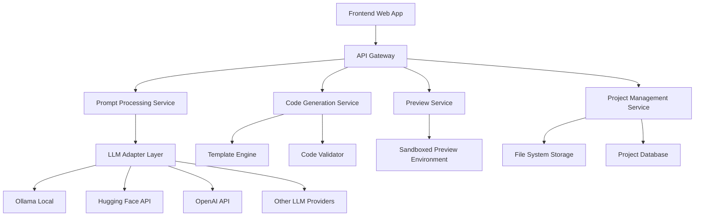

# Design Document

## Overview

Web Builder AI es una plataforma open source que permite generar sitios web completos a partir de descripciones en lenguaje natural. La arquitectura está diseñada para ser modular, escalable y fácil de mantener, utilizando LLMs gratuitos/públicos como Ollama, Hugging Face Transformers, o APIs públicas como OpenAI (con claves propias del usuario).

## Architecture

### High-Level Architecture



### Technology Stack

**Frontend:**
- React 18 con TypeScript
- Vite para build y desarrollo
- Tailwind CSS para estilos
- Monaco Editor para edición de código
- React Query para state management

**Backend:**
- Node.js con Express/Fastify
- TypeScript
- Prisma ORM con SQLite/PostgreSQL
- Docker para containerización
- WebSocket para actualizaciones en tiempo real

**Generated Projects Stack:**
- React + TypeScript + Vite
- Tailwind CSS
- Shadcn/ui para componentes
- React Router para navegación
- Zustand para state management (cuando sea necesario)

## Components and Interfaces

### 1. Frontend Components

#### Main Interface
```typescript
interface MainAppProps {
  onPromptSubmit: (prompt: string) => void;
  onProjectDownload: (projectId: string) => void;
  currentProject?: GeneratedProject;
}

interface PromptInput {
  value: string;
  placeholder: string;
  onSubmit: (prompt: string) => void;
  isLoading: boolean;
}

interface PreviewPanel {
  projectId: string;
  code: GeneratedCode;
  onRefresh: () => void;
}
```

#### Code Editor
```typescript
interface CodeEditor {
  files: ProjectFile[];
  activeFile: string;
  onFileChange: (filename: string, content: string) => void;
  readOnly: boolean;
}
```

### 2. Backend Services

#### Prompt Processing Service
```typescript
interface PromptProcessor {
  processPrompt(prompt: string, context?: ProjectContext): Promise<ProcessedPrompt>;
  validatePrompt(prompt: string): ValidationResult;
  extractRequirements(prompt: string): ProjectRequirements;
}

interface ProcessedPrompt {
  intent: ProjectIntent;
  requirements: ProjectRequirements;
  suggestedTemplate: TemplateType;
  clarificationNeeded?: string[];
}
```

#### Code Generation Service
```typescript
interface CodeGenerator {
  generateProject(requirements: ProjectRequirements): Promise<GeneratedProject>;
  updateProject(projectId: string, modifications: string): Promise<GeneratedProject>;
  validateCode(code: GeneratedCode): ValidationResult;
}

interface GeneratedProject {
  id: string;
  files: ProjectFile[];
  dependencies: PackageDependency[];
  buildConfig: BuildConfiguration;
  deploymentInstructions: string;
}
```

#### LLM Adapter Layer
```typescript
interface LLMProvider {
  name: string;
  isAvailable(): Promise<boolean>;
  generateCode(prompt: string, context: CodeContext): Promise<string>;
  getRateLimit(): RateLimitInfo;
}

interface LLMManager {
  providers: LLMProvider[];
  selectProvider(requirements?: ProviderRequirements): LLMProvider;
  fallbackChain: string[];
}
```

### 3. Template System

#### Template Engine
```typescript
interface Template {
  id: string;
  name: string;
  type: TemplateType;
  baseFiles: ProjectFile[];
  componentLibrary: ComponentDefinition[];
  customizations: TemplateCustomization[];
}

interface TemplateEngine {
  getTemplate(type: TemplateType): Template;
  customizeTemplate(template: Template, requirements: ProjectRequirements): Template;
  generateFromTemplate(template: Template, data: TemplateData): GeneratedProject;
}
```

## Data Models

### Core Models

```typescript
// Project Models
interface Project {
  id: string;
  name: string;
  description: string;
  type: ProjectType;
  status: ProjectStatus;
  createdAt: Date;
  updatedAt: Date;
  files: ProjectFile[];
  versions: ProjectVersion[];
}

interface ProjectFile {
  path: string;
  content: string;
  type: FileType;
  size: number;
  lastModified: Date;
}

interface ProjectVersion {
  id: string;
  projectId: string;
  version: number;
  changes: string;
  files: ProjectFile[];
  createdAt: Date;
}

// Generation Models
interface GenerationRequest {
  prompt: string;
  projectType?: ProjectType;
  existingProjectId?: string;
  llmProvider?: string;
  customizations?: ProjectCustomization[];
}

interface ProjectRequirements {
  type: ProjectType;
  features: Feature[];
  styling: StylingPreferences;
  layout: LayoutPreferences;
  functionality: FunctionalityRequirements;
}

// LLM Models
interface LLMConfiguration {
  provider: string;
  apiKey?: string;
  endpoint?: string;
  model: string;
  maxTokens: number;
  temperature: number;
  isDefault: boolean;
}
```

### Enums and Types

```typescript
enum ProjectType {
  LANDING_PAGE = 'landing_page',
  DASHBOARD = 'dashboard',
  ECOMMERCE = 'ecommerce',
  BLOG = 'blog',
  PORTFOLIO = 'portfolio',
  CUSTOM = 'custom'
}

enum ProjectStatus {
  GENERATING = 'generating',
  READY = 'ready',
  ERROR = 'error',
  UPDATING = 'updating'
}

enum FileType {
  TYPESCRIPT = 'typescript',
  JAVASCRIPT = 'javascript',
  CSS = 'css',
  HTML = 'html',
  JSON = 'json',
  MARKDOWN = 'markdown'
}
```

## Error Handling

### Error Types and Handling Strategy

```typescript
// Custom Error Classes
class LLMError extends Error {
  constructor(
    message: string,
    public provider: string,
    public rateLimited: boolean = false
  ) {
    super(message);
  }
}

class CodeGenerationError extends Error {
  constructor(
    message: string,
    public stage: GenerationStage,
    public recoverable: boolean = true
  ) {
    super(message);
  }
}

class ValidationError extends Error {
  constructor(
    message: string,
    public file: string,
    public line?: number
  ) {
    super(message);
  }
}

// Error Handling Middleware
interface ErrorHandler {
  handleLLMError(error: LLMError): Promise<ErrorResponse>;
  handleGenerationError(error: CodeGenerationError): Promise<ErrorResponse>;
  handleValidationError(error: ValidationError): Promise<ErrorResponse>;
}
```

### Fallback Mechanisms

1. **LLM Fallback Chain**: Si un LLM falla, automáticamente intenta con el siguiente en la cadena
2. **Template Fallback**: Si la generación personalizada falla, usa templates predefinidos
3. **Graceful Degradation**: Funcionalidad básica disponible incluso si servicios avanzados fallan
4. **Error Recovery**: Sistema de retry con backoff exponencial

## Testing Strategy

### Unit Testing
- Servicios individuales con mocks para dependencias externas
- Validadores de código y templates
- Utilidades y helpers

### Integration Testing
- Flujo completo de generación de código
- Integración con diferentes LLM providers
- API endpoints con base de datos real

### End-to-End Testing
- Flujo completo desde prompt hasta descarga
- Diferentes tipos de proyectos
- Manejo de errores y fallbacks

### Performance Testing
- Tiempo de generación de código
- Límites de concurrencia
- Uso de memoria durante generación

### Testing Tools
- Jest para unit tests
- Supertest para API testing
- Playwright para E2E testing
- Artillery para performance testing

## Security Considerations

### API Security
- Rate limiting por IP y usuario
- Validación y sanitización de inputs
- CORS configurado apropiadamente

### Code Generation Security
- Sandboxing de código generado
- Validación de código antes de preview
- Límites en tamaño de archivos generados

### LLM Integration Security
- Encriptación de API keys
- Timeout en requests a LLMs
- Logging sin exponer datos sensibles

## Deployment and Scalability

### Development Environment
- Docker Compose para desarrollo local
- Hot reload para frontend y backend
- Base de datos SQLite para desarrollo

### Production Environment
- Kubernetes deployment
- PostgreSQL como base de datos principal
- Redis para caching y sessions
- CDN para assets estáticos

### Scalability Considerations
- Horizontal scaling del backend
- Queue system para generación de código
- Caching de templates y código generado
- Load balancing entre LLM providers