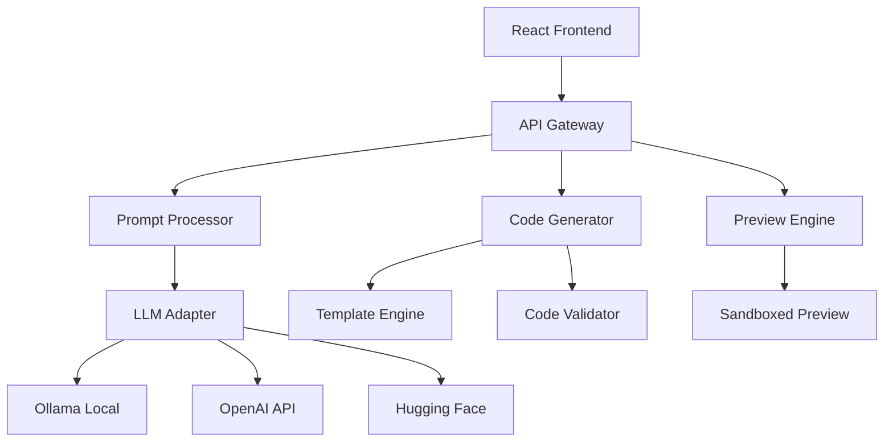

# 🚀 Bird.dev - Web Builder AI

> **The future of web development is here. Generate production-ready websites from simple text descriptions.**

[](https://choosealicense.com/licenses/mit/)
[](https://typescriptlang.org/)
[](https://reactjs.org/)
[](https://nodejs.org/)

---

## 🎯 **Vision**

Bird.dev is revolutionizing web development by democratizing the creation of professional websites. Just describe what you want, and our AI generates complete, production-ready code using the latest technologies. No more starting from scratch, no more boilerplate hell.

**Think V0.dev meets Bolt meets Lovable - but open source and powered by your choice of free LLMs.**

---

## ✨ **What Makes Bird.dev Special**

### 🧠 **AI-Powered Generation**
- **Natural Language to Code**: Describe your vision in plain English, get professional React + TypeScript code
- **Multiple LLM Support**: Works with Ollama, Hugging Face, OpenAI, and other providers
- **Smart Iteration**: Refine and modify your site with follow-up prompts

### 🎨 **Consistent Tech Stack**
- **React 18 + TypeScript**: Modern, type-safe development
- **Tailwind CSS + Shadcn/ui**: Beautiful, responsive designs out of the box
- **Vite**: Lightning-fast development and builds
- **Production Ready**: Every generated project includes proper build configs and deployment instructions

### 🔄 **Real-Time Preview**
- **Live Updates**: See your changes instantly as the AI generates code
- **Sandboxed Environment**: Safe preview of generated websites
- **Error Handling**: Clear feedback when something goes wrong

### 📦 **Complete Projects**
- **Full Source Code**: Download everything you need to deploy
- **Package Management**: Proper dependencies and scripts included
- **Documentation**: Installation and deployment guides included

---

## 🚀 **Quick Start**

```bash
# Clone the repository
git clone https://github.com/holasoymalva/bird.dev.git
cd bird.dev

# Install dependencies
npm install

# Set up your environment
cp .env.example .env
# Add your LLM API keys (optional - works with local Ollama too)

# Start development server
npm run dev

# Open http://localhost:3000 and start building!
```

---

## 💡 **Use Cases**

### 🏢 **Landing Pages**
*"Create a modern SaaS landing page with hero section, features, pricing, and testimonials"*

### 📊 **Dashboards** 
*"Build an analytics dashboard with charts, KPI cards, and data tables"*

### 🛒 **E-commerce**
*"Generate an online store with product catalog, shopping cart, and checkout"*

### 📝 **Blogs**
*"Create a personal blog with post listings, individual post pages, and comments"*

### 🎨 **Portfolios**
*"Design a creative portfolio showcasing projects with image galleries"*

---

## 🏗️ **Architecture**



### **Tech Stack**
- **Frontend**: React 18, TypeScript, Vite, Tailwind CSS, Monaco Editor
- **Backend**: Node.js, Express, Prisma ORM, WebSocket
- **Generated Projects**: React + TypeScript + Vite + Tailwind + Shadcn/ui
- **AI Integration**: Multi-provider LLM support with fallback chains

---

## 🎮 **How It Works**

1. **Describe Your Vision** 📝
   - Enter a natural language description of your website
   - Specify the type (landing page, dashboard, e-commerce, etc.)

2. **AI Magic Happens** ✨
   - Our AI processes your prompt using advanced LLMs
   - Generates complete React + TypeScript code
   - Applies best practices and modern patterns

3. **Preview & Iterate** 👀
   - See your website come to life in real-time
   - Make refinements with additional prompts
   - Version history keeps track of changes

4. **Download & Deploy** 🚀
   - Get the complete project with all files
   - Includes build configs and deployment instructions
   - Ready for Vercel, Netlify, or any hosting platform

---

## 🛠️ **Configuration**

### **LLM Providers**

```javascript
// Configure your preferred LLM providers
{
  "providers": {
    "ollama": {
      "endpoint": "http://localhost:11434",
      "model": "codellama:7b"
    },
    "openai": {
      "apiKey": "your-api-key",
      "model": "gpt-4"
    },
    "huggingface": {
      "apiKey": "your-hf-token",
      "model": "codellama/CodeLlama-7b-Instruct-hf"
    }
  }
}
```

### **Project Templates**

Customize the generated project structure and included components:

```javascript
{
  "templates": {
    "landing_page": {
      "components": ["Hero", "Features", "Pricing", "Testimonials"],
      "pages": ["Home", "About", "Contact"]
    },
    "dashboard": {
      "components": ["Sidebar", "Charts", "DataTable", "KPICard"],
      "pages": ["Dashboard", "Analytics", "Settings"]
    }
  }
}
```

---

## 🤝 **Contributing**

We're building the future of web development, and we'd love your help!

### **Getting Started**
1. Fork the repository
2. Create a feature branch: `git checkout -b feature/amazing-feature`
3. Make your changes and add tests
4. Commit: `git commit -m 'Add amazing feature'`
5. Push: `git push origin feature/amazing-feature`
6. Open a Pull Request

### **Areas We Need Help**
- 🤖 **LLM Integration**: Adding support for new AI providers
- 🎨 **Templates**: Creating new project templates and components
- 🧪 **Testing**: Improving test coverage and E2E tests
- 📚 **Documentation**: Tutorials, guides, and API docs
- 🐛 **Bug Fixes**: Squashing bugs and improving stability

---

## 📊 **Roadmap**

### **Q1 2025**
- ✅ Core MVP with React + TypeScript generation
- ✅ Multi-LLM provider support
- ✅ Real-time preview system
- 🔄 Advanced template system
- 🔄 Project iteration and versioning

### **Q2 2025**
- 📋 Component library integration
- 📋 Advanced styling options
- 📋 Database integration templates
- 📋 API generation capabilities

### **Q3 2025**
- 📋 Team collaboration features
- 📋 Custom component creation
- 📋 Advanced deployment options
- 📋 Plugin ecosystem

---

## 🏆 **Why Choose Bird.dev?**

| Feature | Bird.dev | V0.dev | Bolt | Lovable |
|---------|----------|--------|------|---------|
| **Open Source** | ✅ | ❌ | ❌ | ❌ |
| **Free LLMs** | ✅ | ❌ | ❌ | ❌ |
| **Self-Hosted** | ✅ | ❌ | ❌ | ❌ |
| **Full Code Access** | ✅ | Limited | Limited | Limited |
| **Custom LLMs** | ✅ | ❌ | ❌ | ❌ |
| **No Vendor Lock-in** | ✅ | ❌ | ❌ | ❌ |

---

## 📄 **License**

This project is licensed under the MIT License - see the [LICENSE](LICENSE) file for details.

## 💬 **Community**
- 🐛 **Issues**: [GitHub Issues](https://github.com/holasoymalva/bird.dev/issues)

---

<div align="center">

**Built with ❤️ by developers, for developers**

*Making web development accessible to everyone, one prompt at a time.*

[⭐ Star us on GitHub](https://github.com/holasoymalva/bird.dev) • [🚀 Try the Demo](https://bird.dev) • [📖 Read the Docs](https://docs.bird.dev)

</div>
V0.dev free alternative and Opensource
